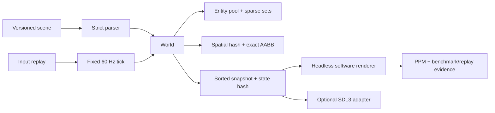

# Forge2D Engine

[](https://github.com/JasonStys/forge2d-engine/actions/workflows/ci.yml)
[](https://github.com/JasonStys/forge2d-engine/actions/workflows/codeql.yml)

A compact C++20 2D engine and deterministic arena sample built to make systems decisions visible:
generation-safe entities, sparse-set components, fixed-timestep simulation, spatial-hash collision,
A* pathfinding, versioned scenes and replays, bounded allocation, software screenshot evidence, an
optional SDL3 frontend, and regression budgets.

The project is intentionally smaller than a commercial engine. Its goal is to demonstrate memory
ownership, data layout, deterministic behavior, parser safety, algorithmic trade-offs, portable
build engineering, and honest performance evidence in a codebase a reviewer can understand.

## What it demonstrates

- C++20 engine core with strict ownership and no runtime dependency.
- C17 linear arena as a narrow, tested cross-language/platform boundary.
- Generation-safe entity handles and sparse-set component storage with expected O(1) access,
  insertion, and removal.
- Integer simulation units and a bounded fixed-step clock for reproducible updates.
- Deterministic spatial-hash broadphase validated against an O(n²) reference implementation.
- Four-neighbor A* with stable tie-breaking and explicit O((V+E) log V) analysis.
- Versioned, bounded, strict scene/replay parsers plus a libFuzzer target.
- Headless software rendering to portable PPM evidence and an optional SDL3 accelerated frontend.
- MSVC, GCC, and Clang builds; warnings-as-errors; ASan/UBSan; fuzz smoke; CodeQL; coverage;
  packaging; and a non-root headless container.

## Architecture



The core never reads wall-clock time, polls a device, or calls SDL. Platform input and elapsed time
are converted into `InputFrame` and tick counts at the adapter boundary. See
[docs/architecture.md](docs/architecture.md) and the
[architecture decision record](docs/adr/0001-headless-core-and-optional-sdl3.md).

## Quick start: headless

Requires CMake 3.25+, Ninja or another supported generator, and a C++20 compiler.

```bash
cmake -S . -B build/dev -G Ninja -DCMAKE_BUILD_TYPE=Debug
cmake --build build/dev --parallel
ctest --test-dir build/dev --output-on-failure
./build/dev/forge2d_arena assets/arena.scene out/demo
./build/dev/forge2d_benchmark
```

On Windows, run the `.exe` files. The demo writes:

- `out/demo/autopilot.replay` — the exact 360 input frames;
- `out/demo/arena-final.ppm` — a deterministic final screenshot;
- JSON on stdout with engine version, ticks, entity/collision counts, state hash, pixel hash, and
  arena high-water mark.

The verified MSVC demo state hash is `2140247359617279822`; a replay mismatch is therefore easy to
detect in a release or interview demonstration.

## Interactive SDL3 sample

SDL3 is optional and fetched from the official 3.4.16 release archive with a checked SHA-256.

```bash
cmake -S . -B build/sdl -G Ninja -DCMAKE_BUILD_TYPE=Release -DFORGE2D_BUILD_SDL=ON
cmake --build build/sdl --target forge2d_arena_sdl --parallel
./build/sdl/forge2d_arena_sdl
```

Use arrow keys to move; Space is captured in replay-ready input state; Escape exits. SDL is kept in
one adapter so tests, servers, and build environments do not require a display.

## Verification

```bash
bash scripts/verify.sh
```

The local MSVC verification has eight deterministic test groups passing with `/W4 /WX /sdl`, the
SDL3 adapter compiled successfully, and all benchmark budgets passed:

| Scenario             |                   Workload | Local result |   Budget |
| -------------------- | -------------------------: | -----------: | -------: |
| Sparse-set lifecycle |            20,000 entities |     10.37 ms | 1,000 ms |
| Spatial broadphase   |               20,000 AABBs |     55.81 ms | 2,500 ms |
| Fixed simulation     | 5,000 entities × 240 ticks |    119.92 ms | 2,500 ms |

Timing is host-specific and is not a frame-rate claim. CI reruns the budgets on GCC, Clang, and
MSVC and retains machine-readable reports. See [docs/reports/benchmark.md](docs/reports/benchmark.md)
and [docs/testing.md](docs/testing.md).

## Repository guide

| Area               | Responsibility                                                                   |
| ------------------ | -------------------------------------------------------------------------------- |
| `include/forge2d/` | public engine contracts and header-only storage/timing utilities                 |
| `src/`             | collision, pathfinding, parsing, replay, world, software, and SDL implementation |
| `platform/`        | bounded C17 arena API and implementation                                         |
| `apps/`            | headless evidence demo and interactive SDL3 arena                                |
| `assets/`          | small versioned text scene with no third-party art                               |
| `tests/`           | deterministic unit, property/reference, negative, and integration tests          |
| `fuzz/`            | libFuzzer target and seed corpus for the scene trust boundary                    |
| `benchmarks/`      | executable regression budgets and JSON output                                    |
| `docs/`            | architecture, formats, algorithms, operations, research, and reports             |
| `.github/`         | cross-platform CI, CodeQL, dependency review, and update automation              |

Every authored file is summarized in [docs/file-catalog.md](docs/file-catalog.md); exact class,
function, and important-variable locations are generated in
[docs/code-index.md](docs/code-index.md).

## Scope and limitations

Forge2D is a portfolio engine, not a claim of production completeness. It has no audio mixer,
networking, scripting runtime, texture pipeline, physics solver, general editor, or 3D renderer.
Collision output is detection evidence, not continuous collision response. Integer simulation and
canonical ordering improve determinism, but the repository does not claim network lockstep across
unverified compilers/platforms. See [docs/operations.md](docs/operations.md).

## Documentation

- [Architecture](docs/architecture.md)
- [Public API](docs/api.md)
- [Scene and replay formats](docs/asset-format.md)
- [Determinism and replay](docs/determinism.md)
- [Gameplay sample](docs/gameplay.md)
- [Complexity](docs/complexity.md)
- [Testing strategy](docs/testing.md)
- [Operations and release](docs/operations.md)
- [Research](docs/research.md)
- [Latest maintenance audit](docs/reports/maintenance-audit-2026-09-18.md)

## License

[MIT](LICENSE)
